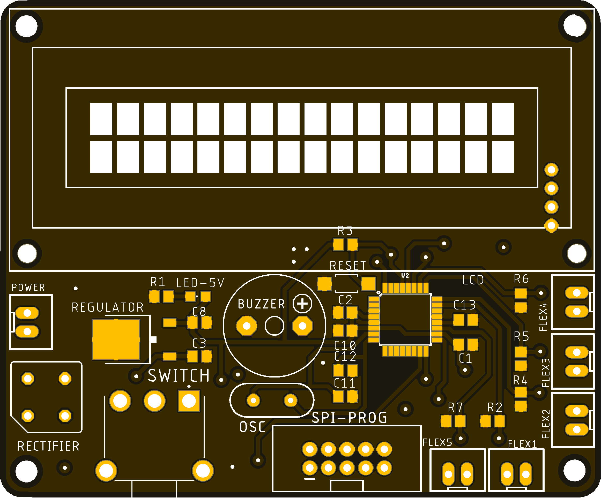
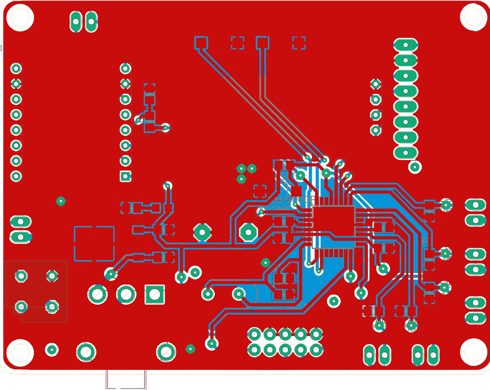

# Silentra: Silent Translation: Facilitating Communication for Individuals with Speech Impairments 🗣️
*A gesture-based communication device that translates hand signs into text, built with Arduino, flex sensors, and custom hardware.*

 <br>
This project is dedicated to breaking down communication barriers for the mute community by providing an intuitive and accessible tool to express thoughts and words.

[](https://www.arduino.cc/)
[](https://opensource.org/licenses/MIT)

---

### 📋 Table of Contents

1.  [How It Works ⚙️](#how-it-works-⚙️)
2.  [Hardware & Components 🛠️](#hardware--components-🛠️)
3.  [Gesture Diagram & Mappings ✋](#gesture-diagram--mappings-✋)
4.  [The Custom PCB ⚡](#the-custom-pcb-⚡)
5.  [Software Setup & Code 💾](#software-setup--code-💾)
6.  [Calibration is Key! 🎯](#calibration-is-key-🎯)
7.  [Future Improvements 🚀](#future-improvements-🚀)
8.  [License](#license-⚖️)

---

## How It Works ⚙️

The Silentra glove works in a simple, four-step process to convert movement into language.

1.  🖐️ **Sensing the Gesture**: Five flex sensors are attached to a glove, one for each finger. When the user bends a finger, the sensor's electrical resistance changes.
2.  🧠 **Processing the Data**: An Arduino microcontroller reads the resistance value from each of the five sensors.
3.  🔄 **Translating to Text**: The code compares the sensor readings to pre-set threshold values. Based on which combination of sensors is "bent" or "straight," it maps the gesture to a specific character (e.g., 'a', 'b', 'c') or a command (like 'space' or 'delete').
4.  📺 **Displaying the Output**: The character is added to a string of text, which is immediately displayed on a 16x2 LCD screen for others to read.

---

## Hardware & Components 🛠️

- **Microcontroller**: Arduino Nano / Pro Micro (or similar)
- **Sensors**: 5 x Flex Sensors
- **Display**: 16x2 I2C Liquid Crystal Display (LCD)
- **Alert**: 5V Piezo Buzzer
- **Power**: 5V power source (USB or battery)
- **Core**: Custom Designed PCB (Version 1 & 2)
- **Enclosure**: A comfortable glove to mount the sensors

---

## Gesture Diagram & Mappings ✋

To understand the code, you need to know which sensor corresponds to which finger. Here is the layout used in this project.

```plaintext
           . . . . . . . . . . . . . . . . . .
           .                                 .
           .        .----.                   .
           .       | F2  | Index              .
           . .----.| .--. |                   .
           . | F3 || F1 || .----.             .
           . | .--.||.--.|| F4  | Middle / Ring .
           . | |  |||  ||| .--. |             .
           . | |  |||  ||| |  | | .----.      .
           . | |  |||  ||| |  | | | F5  | Pinky .
           . | |  |'--'| | |  | | '--'| |      .
           . '--'| |--'| '--'| '--'--'  .
           .     | |   '----'           .
           .     | Thumb                .
           .     ' . . . . . . . . . . . .
           . . . . . . . . . . . . . . . ..
```
Based on the provided code, here are the defined gestures:

| Output | Finger Combination (Bent) | Code Logic |
| :----: | :------------------------ | :--- |
| **a** | Thumb | `F1` |
| **b** | Index | `F2` |
| **c** | Middle | `F3` |
| **d** | Ring | `F4` |
| **e** | Pinky | `F5` |
| **f** | Thumb + Index | `F1 + F2` |
| **g** | Thumb + Middle | `F1 + F3` |
| **h** | Thumb + Ring | `F1 + F4` |
| **i** | Thumb + Pinky | `F1 + F5` |
| **j** | Thumb + Index + Middle | `F1 + F2 + F3` |
| **k** | Thumb + Index + Ring | `F1 + F2 + F4` |
| **l** | Thumb + Index + Pinky | `F1 + F2 + F5` |
| **m** | Thumb + Middle + Ring | `F1 + F3 + F4` |
| **n** | Thumb + Ring + Pinky | `F1 + F4 + F5` |
| **o** | Index + Middle + Ring | `F2 + F3 + F4` |
|**(space)**| Index + Middle + Ring + Pinky | `F2+F3+F4+F5` |
|**DELETE** | Ring + Pinky | `F4 + F5` |
| **CLEAR** | All Fingers (Fist) | `F1+F2+F3+F4+F5`|

---

## The Custom PCB ⚡

To make the Silentra glove robust and easy to assemble, we designed a custom Printed Circuit Board (PCB). This avoids messy wires and creates a stable platform for all the electronics. We have developed two versions of the board.

### Version 1.0 (The Original)
*This was our first prototype, proving the concept and integrating the essential components.*


### Version 2.0 (The Refined Model)
*Learning from V1, the second version introduces significant improvements in layout, power management, and durability.*


### Comparison: V1 vs. V2

*   **Size & Form Factor**: *e.g., "The V2 board is 30% smaller, making the final device much more lightweight and comfortable."*
*   **Component Layout**: *e.g., "We repositioned the sensor connectors on V2 for easier glove assembly and to reduce strain on the cables."*
*   **Power Circuitry**: *e.g., "V2 includes improved voltage regulation and reverse polarity protection, making it safer to use with different power sources."*
*   **Durability**: *e.g., "The V2 board uses thicker copper traces and adds mounting holes for securing it into a potential 3D printed case."*
*   **Ease of Assembly**: *e.g., "Component labels are clearer on V2, and we switched to through-hole components for the main connectors to make soldering easier for beginners."*

---

## Software Setup & Code 💾

To get the project running, you'll need the Arduino IDE and a couple of libraries.

1.  **Install Arduino IDE**: If you don't have it, download it from the [official Arduino website](https://www.arduino.cc/en/software).

2.  **Install Libraries**: The code requires the `LiquidCrystal_I2C` library. You can install it directly from the IDE:
    *   Go to `Sketch` -> `Include Library` -> `Manage Libraries...`
    *   In the search bar, type `LiquidCrystal I2C`.
    *   Find the library by **Frank de Brabander** and click `Install`.
    *   The `Wire.h` library is built-in, so no installation is needed.

3.  **Upload the Code**:
    *   Connect your Arduino board to your computer.
    *   Select the correct Board and Port from the `Tools` menu.
    *   Copy the code from the `.ino` file in this repository into a new sketch.
    *   Click the `Upload` button.

---

## Calibration is Key! 🎯

> **IMPORTANT:** The default sensor thresholds in the code (`min1`, `min2`, etc.) are just examples. You **MUST** calibrate them for your specific sensors and your hand for the device to work correctly.

Here's how to calibrate your glove:

1.  In the `loop()` function of the code, temporarily comment out the line that prints the letters and uncomment the debug lines.

    ```cpp
    // In the loop() function:

    // lcd.print(letters); // <-- COMMENT THIS LINE OUT

    // UNCOMMENT these lines to see sensor values
    lcd.setCursor(0, 1);
    lcd.print("                "); // Clear the line
    lcd.setCursor(0, 1);
    lcd.print("F1:"); lcd.print(F1);
    lcd.print(" F2:"); lcd.print(F2);
    // Add more for F3, F4, F5 as needed
    ```

2.  Upload this modified code to your Arduino. The LCD will now show the live analog readings from the sensors.

3.  For each finger, do the following:
    *   Hold the finger **straight** and write down the value shown on the LCD.
    *   Bend the finger **completely** and write down the new, lower value.

4.  Choose a threshold value that is roughly in the middle of the "straight" and "bent" readings. For example, if a sensor reads `350` when straight and `190` when bent, a good threshold would be around `210`.

5.  Update the `min1`, `min2`, `min3`, `min4`, and `min5` variables at the top of the code with your new, calibrated values.

6.  Re-comment the debug lines and uncomment `lcd.print(letters);` to restore the normal text-translation functionality. Upload the final code.

---

## Future Improvements 🚀

The Silentra project has a lot of potential for growth:

*   **Text-to-Speech**: Add a TTS module (like the JQ6500 or DFPlayer Mini) to speak the generated text aloud.
*   **Machine Learning**: Implement a neural network (e.g., using TensorFlow Lite for Microcontrollers) to recognize more complex and nuanced gestures, moving beyond simple on/off states.
*   **Wireless Communication**: Integrate a Bluetooth module (like the HC-05) to send the translated text to a custom smartphone app.
*   **Expanded Gesture Library**: Increase the number of recognized signs to include numbers, punctuation, and common words/phrases for faster communication.

---

## License ⚖️

This project is licensed under the MIT License. See the `LICENSE.md` file for details.
